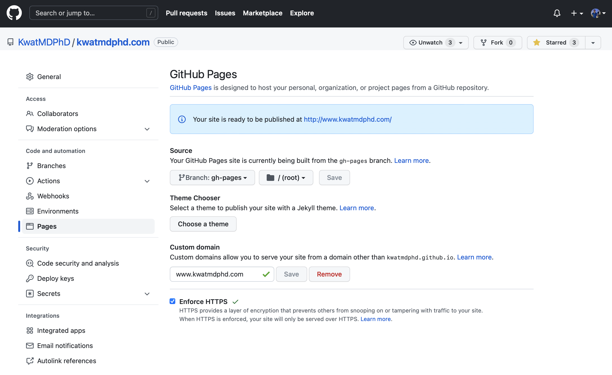

🤠

```bash
touch static/.nojekyll
```

```bash
npm install --save-dev gh-pages
```

```bash
gh-pages --dist build
```


https://docs.github.com/en/pages/configuring-a-custom-domain-for-your-github-pages-site




https://analytics.google.com

Make a property

Insert `Global site tag` into `<head>`


---

Made by https://github.com/KwatMDPhD/Kata.jl 🔴
