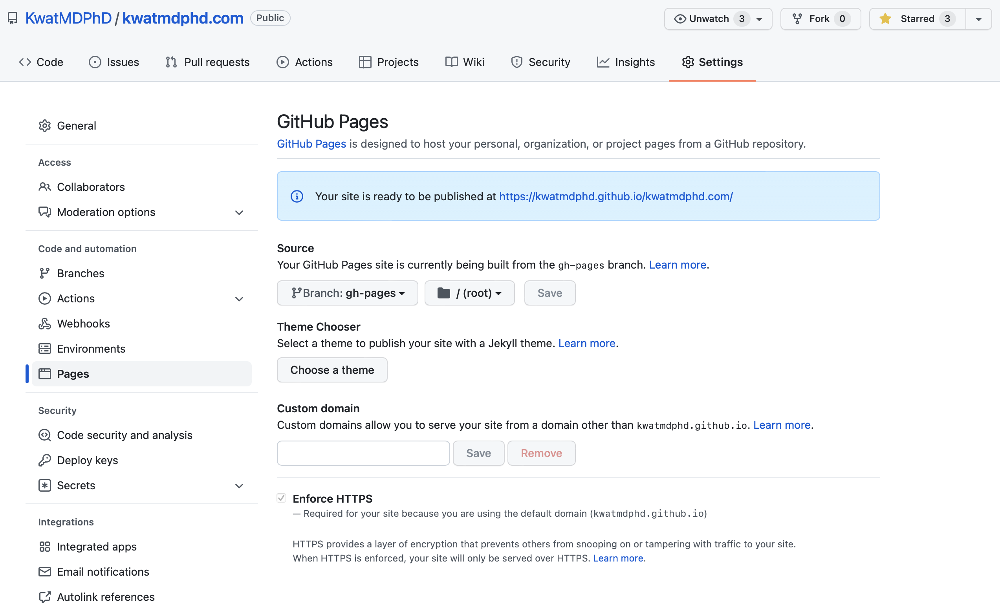
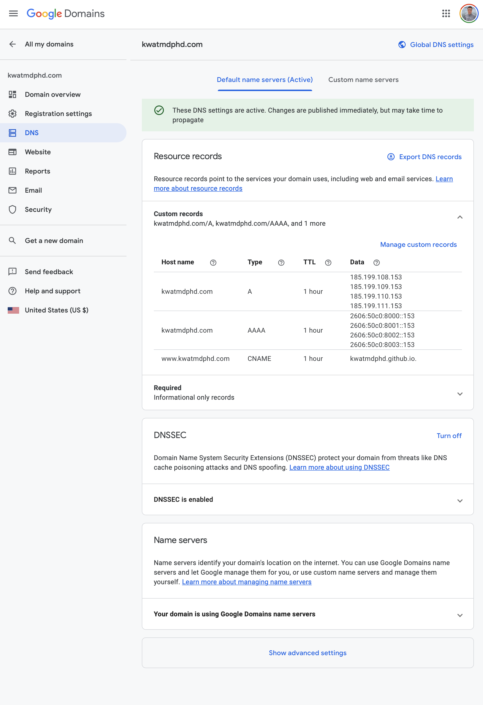
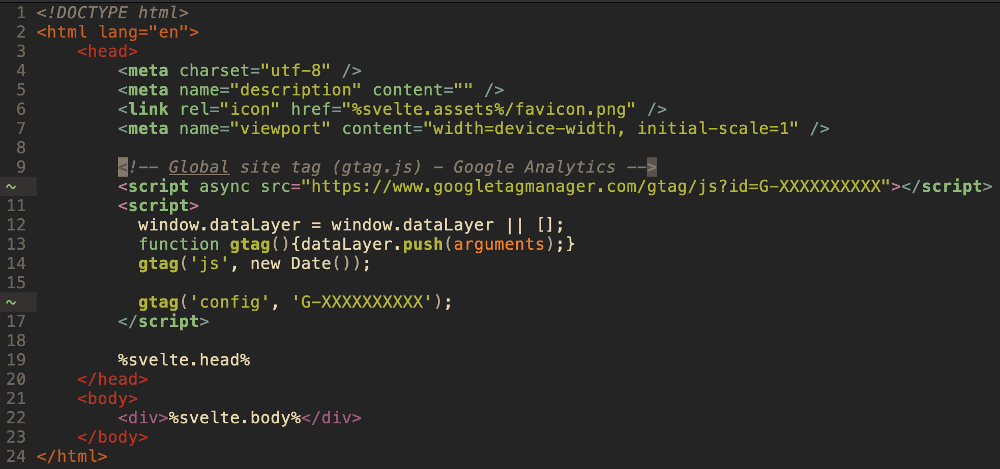

https://kit.svelte.dev/docs/project-structure

https://svelteland.github.io/svelte-kit-blog-demo/deply-to-github

https://javascript.plainenglish.io/sveltekit-github-pages-4fe2844773de

https://svelte.dev/tutorial

https://kit.svelte.dev/docs

https://joshcollinsworth.com/blog/introducing-svelte-comparing-with-react-vue

https://w3schools.com/sass/sass_intro.php

https://rodneylab.com/getting-started-with-sveltekit/

https://rodneylab.com/sveltekit-lib

https://joshcollinsworth.com/blog/build-static-sveltekit-markdown-blog

https://www.youtube.com/watch?v=fYq5PXgSsbE

https://www.youtube.com/watch?v=lLdzlLL33G8

https://developer.mozilla.org/en-US/docs/Web/JavaScript/Guide/Using_promises

https://stackify.com/when-to-use-asynchronous-programming

https://css-tricks.com/what-i-like-about-writing-styles-with-svelte

https://css-tricks.com/the-sass-ampersand

https://sparkbox.com/foundry/how_to_use_ampersands_to_simplifiy_your_sass

https://aleen42.gitbooks.io/css/content/codrops/pseudoClass/after/after.html

Put everything in "devDependencies".

## Make the simplest svelte app.

Make the most minimal app (select `Skeleton project` and no to everything else);

```bash
npm init svelte@next
```

Install dependencies;

```bash
npm install
```

Run the app;

```bash
npm run dev -- --open
```

## Take a look at the app.

Build the app;

```bash
ls -l .svelte-kit
```

```bash
npm run build
```

```bash
ls -l .svelte-kit
```

Preview the build;

```bash
npm run preview -- --open
```

## Publish the app to GitHub Pages.

Follow https://kit.svelte.dev/docs#adapters-supported-environments-static-sites.

Install `adapter-static` (for only during development);

```bash
npm install --save-dev @sveltejs/adapter-static@next
```

Edit `svelte.config.js`;

```diff
-import adapter from '@sveltejs/adapter-auto';
+import adapter from '@sveltejs/adapter-static';
```

Build;

```bash
ls -l .
```

Carry `.nojekyll` so that GitHub nojekyll does not mess with this app;

```bash
touch static/.nojekyll
```

Add to svelte.config.js config

```json
  kit: {
    paths: {
      base: dev ? "" : process.env.BASE_PATH,
    },
  },
```

```bash
npm run build
```

```bash
ls -l .
```

Use `gh-pages` to deploy the app to `gh-pages` branch;

```bash
npm install --save-dev gh-pages
```

```bash
gh-pages --dist build
```

`gh-pages` updates the repository;


Set `Pages`;



Look at the deployment with private browsing, which does not cache.

## Grow the app.

Edit `src/routes/index.svelte`.

Remove old build;

```bash
rm -fr build
```

Build;

```bash
npm run build
```

Deploy;

```bash
gh-pages --dist build --dotfiles
```

If the update does not show up, clear cache or use private browsing, which does not cache.

Remember this rebuild-deploy sequence as `scripts.deploy` in `package.json`;

```json
    "build": "svelte-kit build",
    "deploy": "rm -rf build && npm run build && gh-pages --dist build --dotfiles",
```

Edit more.

Run the sequence;

```bash
npm run deploy
```

Repeat.

## Set a custom domain.

Read https://docs.github.com/en/pages/configuring-a-custom-domain-for-your-github-pages-site.

Update DNS;



Check `Pages`;


Make `CNAME` with 1 line, the domain;

```bash
echo "KwatMDPhD.com" > static/CNAME
```

## Set [Google Analytics](https://analytics.google.com).

Make a property.

Insert `Global site tag` into `<head>`;


